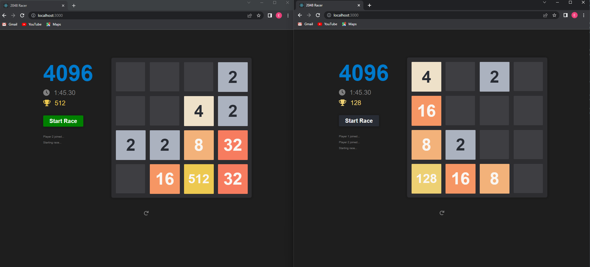
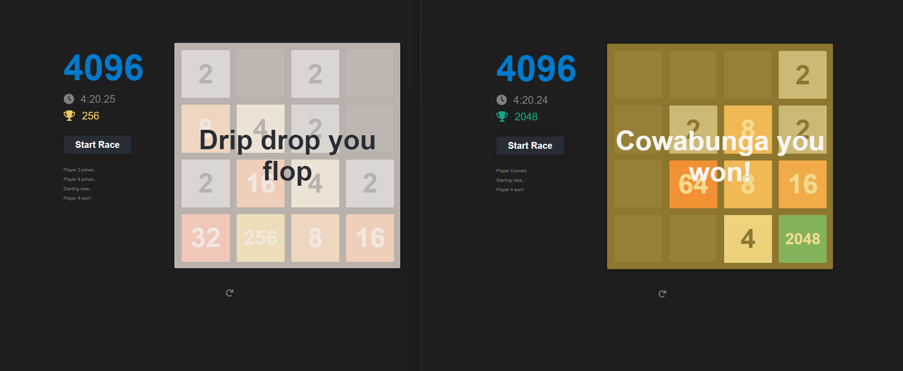

Race your friends to the 2048 tile!

---

---

Bug list:
* Endgame functionality doesn't work after someone's beaten the game once.

Deployment coming very soon B)

### Usage
If you wish to run locally
1. Fork the repo
2. Open a terminal window, then navigate to 2048Racer/backend
    * run `go run main.go`
OR
    * run `docker build -t backend .`
    * then `docker run -it -p 8080:8080 backend`
3. Open another terminal window, then navigate to 2048Racer/frontend.
    * run `npm start`

Start racing!
